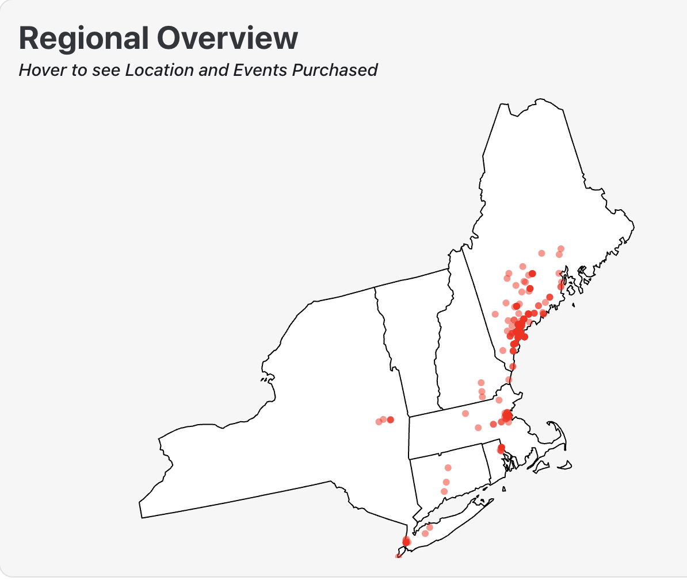
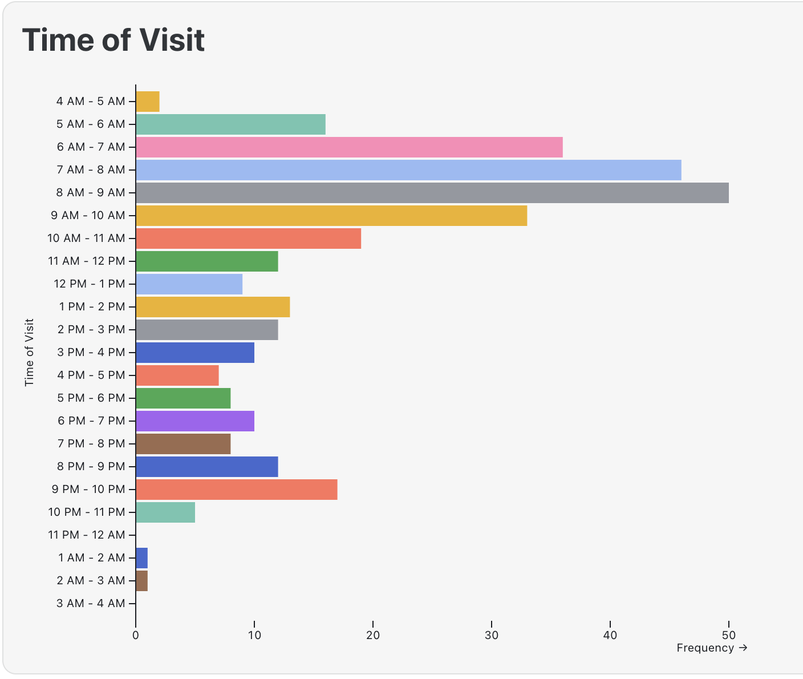
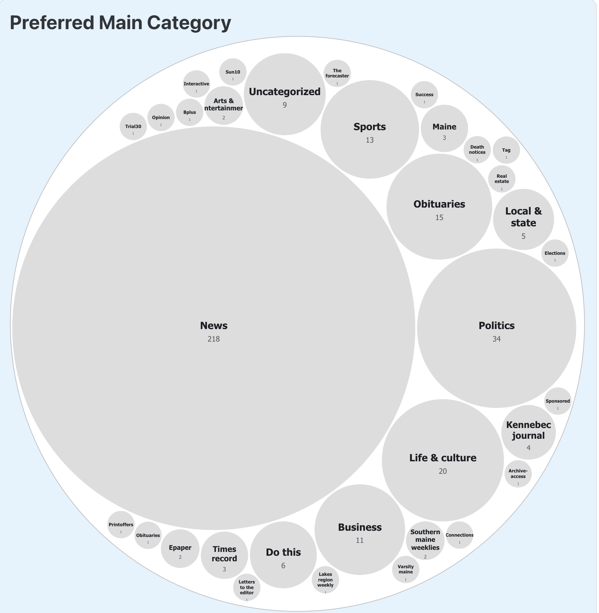
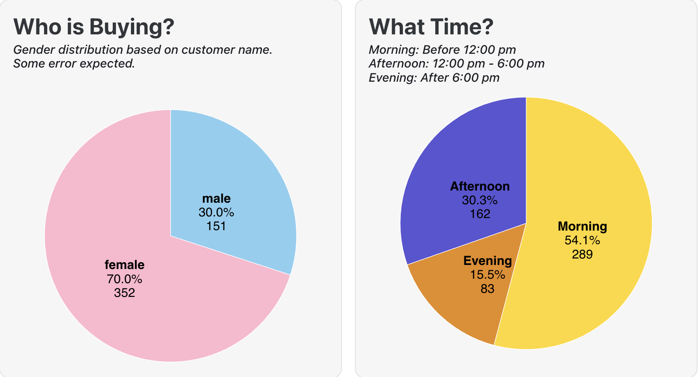
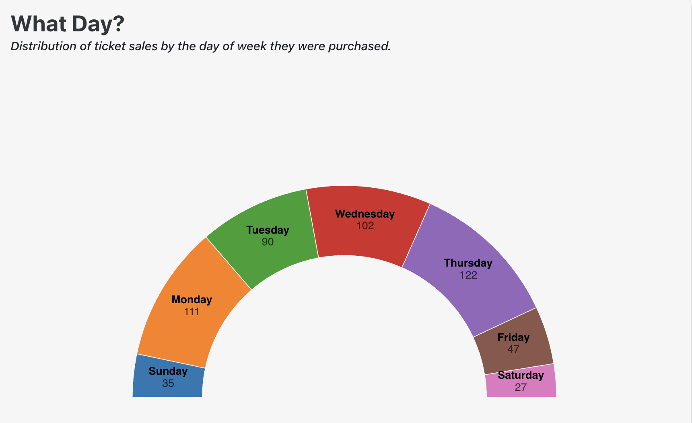
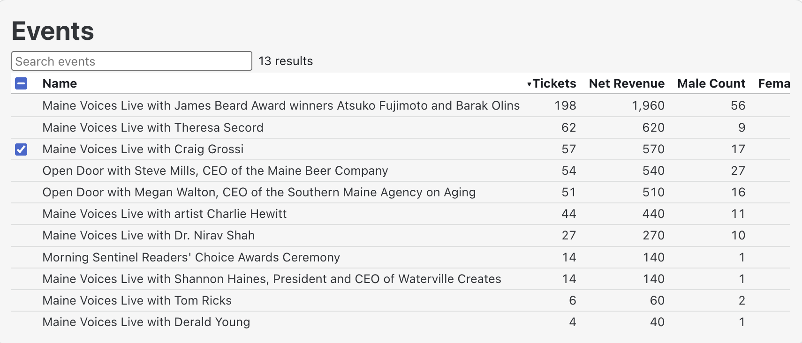
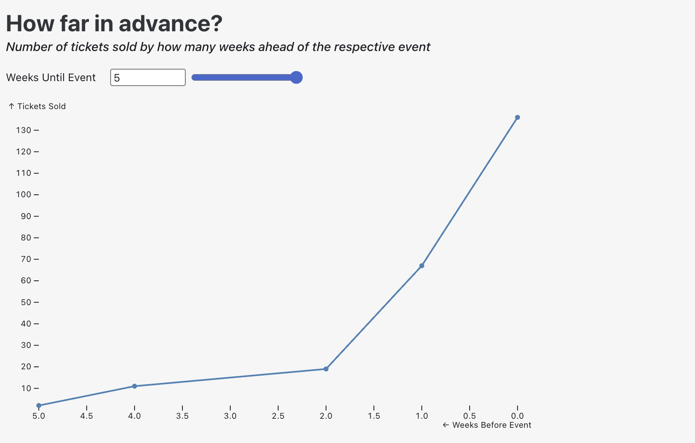

# Visualization for Maine Trust for Local News

This project took data supplied by the [Maine Trust for Local News](https://www.metln.org/) to look at both information from indiviual events, common trends across all events as well as a customer overview. 
Many of these graphs are dynamic in nature so we recommend launching the obvservable webpage on your local machine by following the [instructions on how to run](#how-to-run) if you have the proper data.

## Methodology
The Main Trust for Local News supplied all the data from their internal records. For the purpose of these visualizations we filtered out any null or empty data cells as those were overwhelming the data sets. We also used [gender-detection-from-name](https://www.npmjs.com/package/gender-detection-from-name).  This detects gender by first name and there is room for error, especially with more neutral names (Sam, Pat etc).  
For Weeks before we capped it at a max of 10 weeks out. METLN expressed that they had to move some dates which was causing outliers (over 30 weeks out) which was skewing the data. If there is new data that includes tickets that go on sale substantially before the event this will need to be updated within the code. 

## All Customers Trends 

To get a general sense of who is buying interacting with the webpages we can look at the entire customer database. That will give us a sense of the reach of who is attending events.
By Hovering over the map we can see what town the customers are based in as well as their purchase patterns.  The reach for METLN is far broader than might be anticipated and customers with vacation homes or second primary residences cannot be discounted by looking at these maps. 

 

We can also quickly see what time of day they are on the webpages as well as what they're preferred category is.  

 
 

As could be expected many people read the news in the morning, with the ocassional scrolling at night.  Looking at this data the majority of users use News or Local News as their main pages. 

## Total Event Trends 
We can see what purchase patterns across all the provided events. 
The majority of customers buying tickets are women across nearly every event. We also see trends in early morning buying as well as weekday (particularly Monday and Tuesday) purchasing. 

 
 

*We used an NLP library to take customer first name and map it to likely gender. This will not be 100% accurate*


## Single Event Trends 

To get a bit more granular we can look at individual events by narrowing down the instances using the checkboxes.  For example, if you're only interested in the one event below: 

 

From there you can get information for the event or events that you care about including day of week, time of day they purchased, gender as well as how far in advance tickets were purchased.

 

We do not have the data as to when campaigns for certain events were used but a future project may want to compare when email campaigns were sent vs ticket purchases from them. 

## Going Forward 
METLN has discussed data collection when they sell tickets. If that is something they implement reworking the gender pie graphs with actual data will give a more accurate picture.  Also gathering data as to where customers bought tickets (ie from email, the newspaper or Facebook campaigns) will also help with targeting techniques.  

This is a result of 2 iterations with METLN and is a working prototype based on those discussions.  The Customer Overview database was a recent addition in the final iteration and is a working prototype to add a more hollistic view to the customer profile.  We made visualizations based on what we were told could be interesting but someone from METLN who has a better understanding on the data pulled may be able to lend some insight. 
## How to Run 

This is made in Observable framework. For instructions on how to run that on your machine you can visit the documenation [here](METLN/README.md)

Once you get the required data (this includes a csv for transactions as well as an Event_Purchaser csv for the customer overview) save the files to your local machine under in the [data folder](METLN/src/data)- this is located in the src file in the framework. 

If the data is where it should be you can run the following command from the src file to run the interactive framework 

```
npm run dev 
```
